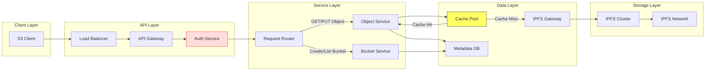

```mermaid
flowchart LR
    subgraph Client Layer
        A[S3 Client]
    end
    
    subgraph API Layer
        B[Load Balancer]
        C[API Gateway]
        D[Auth Service]
    end
    
    subgraph Service Layer
        E[Request Router]
        F[Object Service]
        G[Bucket Service]
    end
    
    subgraph Data Layer
        H[Cache Pool]
        I[Metadata DB]
        J[IPFS Gateway]
    end
    
    subgraph Storage Layer
        K[IPFS Cluster]
        L[IPFS Network]
    end
    
    A --> B --> C --> D
    D --> E
    E -->|"GET/PUT Object"| F
    E -->|"Create/List Bucket"| G
    F --> H -->|Cache Miss| J --> K --> L
    F --> I
    G --> I
    H -->|Cache Hit| F
    
    style D fill:#fdd,stroke:#f33
    style H fill:#ff6,stroke:#333
```