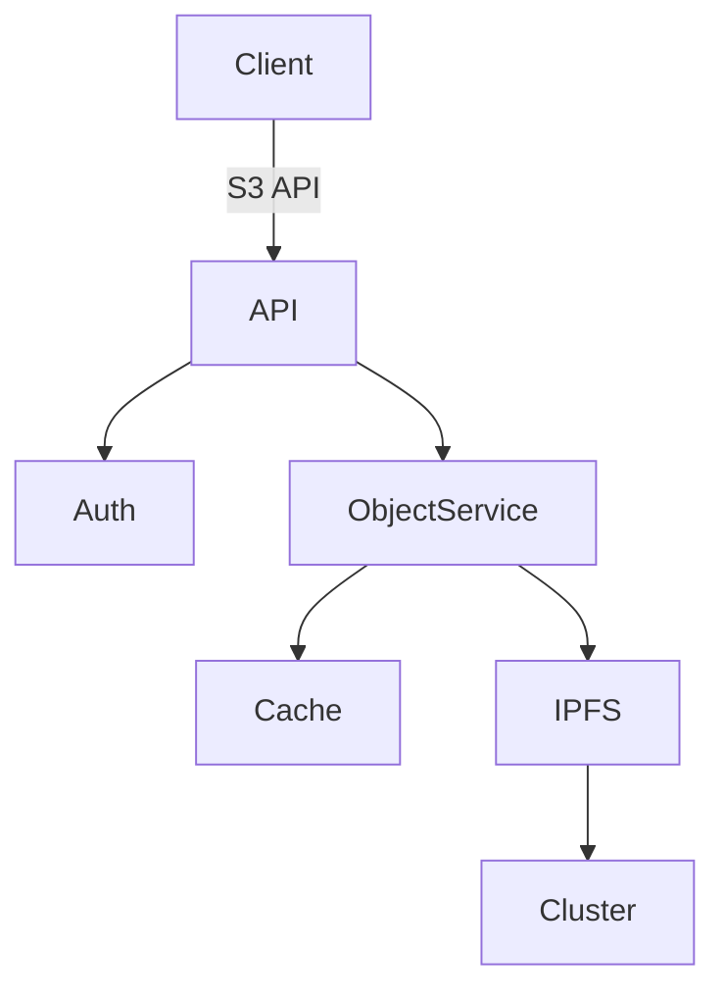

# System Architecture

## Overview
The gateway provides an S3-compatible API interface for storing data on IPFS, with the following core components:



## Core Components

### API Gateway
- Handles HTTP REST requests
- Routes to appropriate services
- Transforms requests/responses

### Auth Service
- AWS Signature v4 verification
- IAM policy evaluation
- JWT token generation

### Object Service
- Processes PUT/GET/DELETE operations
- Manages object versioning
- Interfaces with metadata DB

### Cache Layer
- Redis for frequent metadata
- In-memory cache for hot objects
- Cache invalidation strategy

## Data Model

```typescript
interface S3Object {
  bucket: string
  key: string
  cid: string    // IPFS Content ID
  versions: CID[]
  metadata: {
    size: number
    contentType: string
    userMetadata: Record<string, string>
  }
}