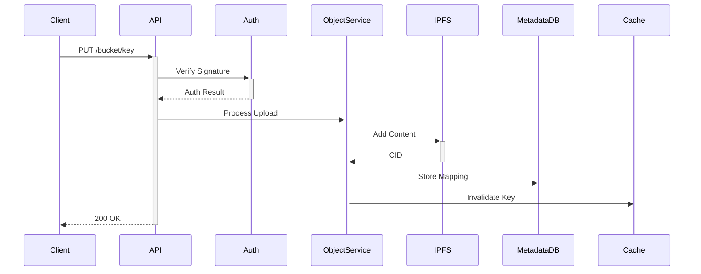
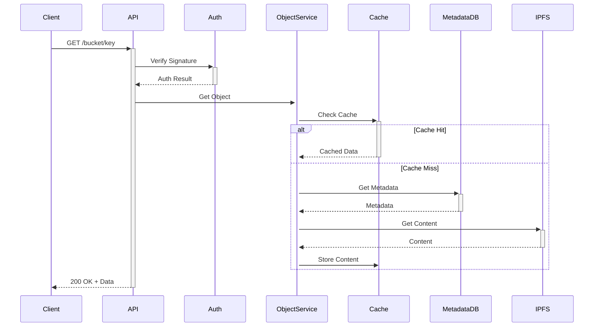
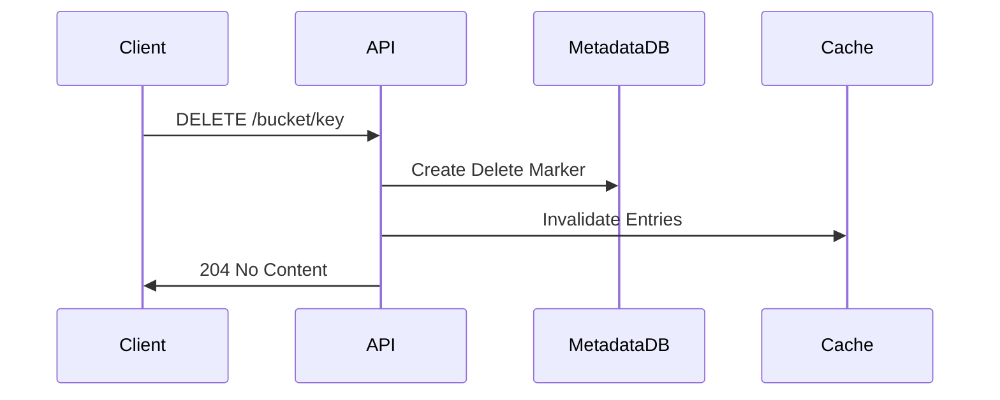

# Request Processing Flows

## 1. PUT Object Flow

```mermaid
sequenceDiagram
		Client->>+API: PUT /bucket/key
		API->>+Auth: Verify Signature
		Auth-->>-API: Auth Result
		API->>+ObjectService: Process Upload
		ObjectService->>+IPFS: Add Content
		IPFS-->>-ObjectService: CID
		ObjectService->>MetadataDB: Store Mapping
		ObjectService->>Cache: Invalidate Key
		API-->>-Client: 200 OK
```

## 2. GET Object Flow

```mermaid
sequenceDiagram
    Client->>+API: GET /bucket/key
    API->>+Auth: Verify Signature
    Auth-->>-API: Auth Result
    API->>+ObjectService: Get Object
    ObjectService->>+Cache: Check Cache
    alt Cache Hit
        Cache-->>-ObjectService: Cached Data
    else Cache Miss
        ObjectService->>+MetadataDB: Get Metadata
        MetadataDB-->>-ObjectService: Metadata
        ObjectService->>+IPFS: Get Content
        IPFS-->>-ObjectService: Content
        ObjectService->>Cache: Store Content
    end
    API-->>-Client: 200 OK + Data
```

## 3. DELETE Object Flow

(Note: IPFS doesn't physically delete)

```mermaid
sequenceDiagram
    Client->>API: DELETE /bucket/key
    API->>MetadataDB: Create Delete Marker
    API->>Cache: Invalidate Entries
    API->>Client: 204 No Content
```